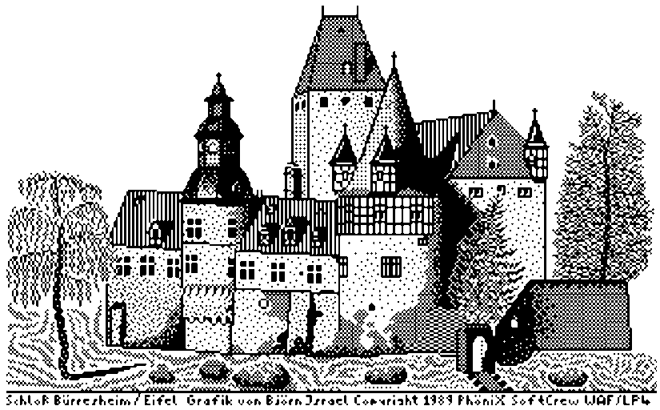
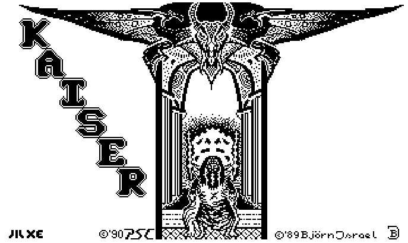
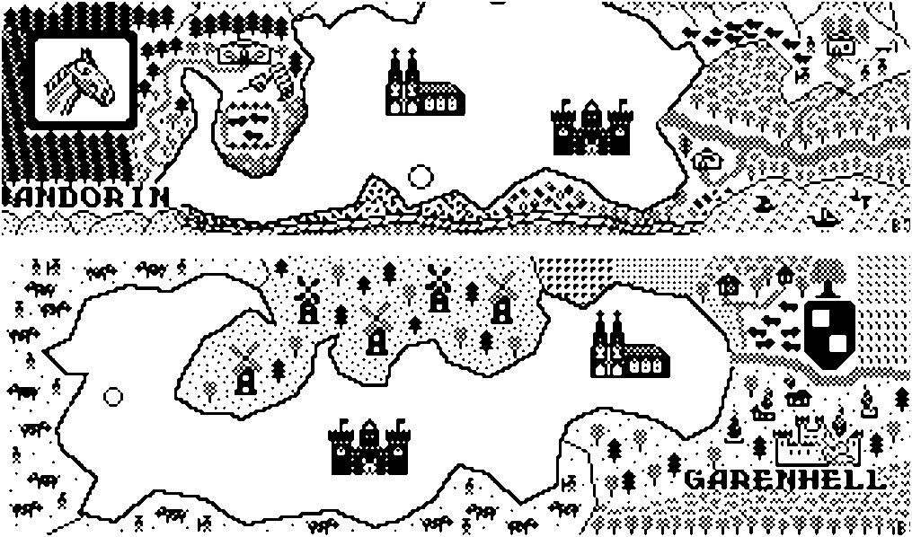
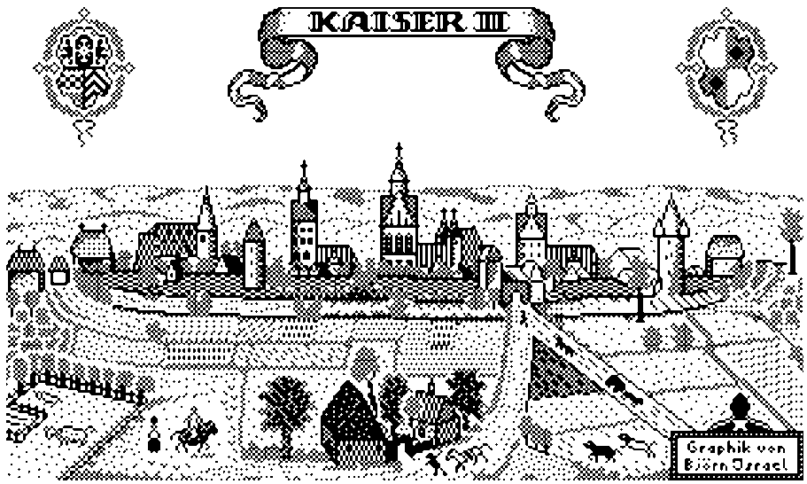
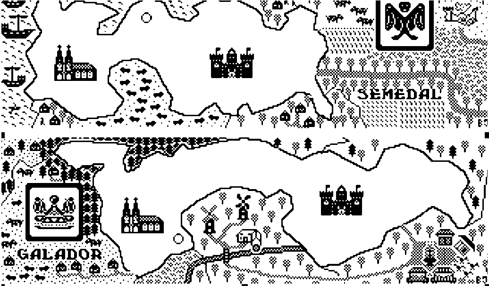
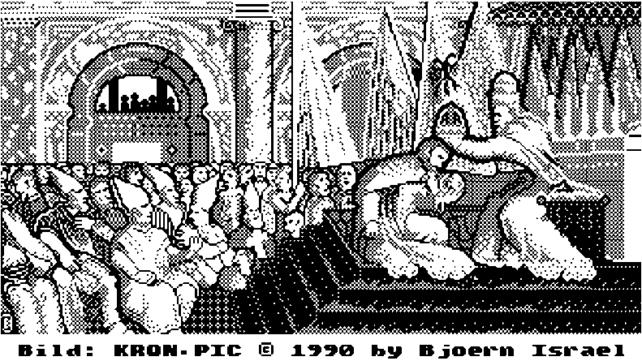

# Kaiser 2 - Anleitung

(Anno 1700) eine strategische Wirtschaftssimulation für 1-4 SpielerInnen

## Inhaltsverzeichnis

1. Spielanleitung
2. Namenseingabe
3. Startbild
4. Handelshäuser
5. Handelspartner
6. Korn
7. Kornausgabe
8. Landhandel
9. Chronik
10. Staatseinnahmen
11. Handelsdaten
12. Übersichtskarte
13. Staatseinkäufe
14. Geheimdienst
15. Todesfall



## 1 Spielanleitung

Laden des Spiels:

Schalten Sie Ihr Diskettenlaufwerk ein und legen Sie die Kaiser II Diskette mit der ersten Seite (Etikett nach oben) ein. Nun können Sie den Computer einschalten. Erscheint die Meldung "KAISER II, BOOTE ERSTE SEITE" so müssen Sie die Diskette umdrehen und eine beliebige Funktionstaste drücken (z. B. START). Der Bildschirm wird nun schwarz und das Spiel wird geladen. Wenn das Titelbild erscheint, können Sie sich die Musik bis zum Ende anhören oder sie mit dem Feuerknopf des Joysticks in Port 1 abbrechen.



K A I S E R    I I

Phönix SoftCrew 1988-95

```plain

 \*\*\* A - B - C - D - E - F - G - H - I - J - K - L - M \*\*\*

 1 DW0-O1S-U4M-4OL-10Q-RE9-8G4-J23-VVO-MR7-ZP2-88I-G31
 -----------------------------------------------------
 2 916-DDW-AU8-M50-FE4-M20-999-4K5-WR4-6V6-V12-ATA-DAF
 -----------------------------------------------------
 3 YYX-BEN-96R-ALF-RBA-33E-EE3-E3E-3E3-MBB-WAF-4G6-NTE
 -----------------------------------------------------
 4 REN-WER-WOH-71O-003-PLK-DON-7M7-OO7-GFA-8B8-IKW-ISS
 -----------------------------------------------------
 5 5F5-E92-F8M-L3W-8MS-BI0-CST-ARI-130-XE0-10F-50T-SSS
 -----------------------------------------------------
 6 ABC-198-QOQ-ZPW-LTR-L5K-KGB-NAS-82I-HUA-AST-0LS-MGM
 -----------------------------------------------------
 7 971-DSA-EAV-85T-T58-44W-UDC-DSK-5TD-300-UIU-TES-4OD
 -----------------------------------------------------
 8 REW-560-SEC-SEL-323-GLX-SET-MSL-ASR-43I-M3O-E0O-ELO
 -----------------------------------------------------
 9 NAS-E60-503-GTI-YRI-ACE-FOX-4GH-TV5-RDW-8EW-EGN-GCA
 -----------------------------------------------------
10 WHY-8KA-RAT-5Y6-92V-00L-DRG-MIN-EES-4RR-3NS-0YY-ZXX
 -----------------------------------------------------


 \*\*\* N - O - P - Q - R - S - T - U - V - W - X - Y - Z \*\*\*

 1 FIX-7DS-2RR-9R5-TE2-DEL-VFR-5V0-SIN-777-20B-LTD-HYD
 -----------------------------------------------------
 2 CTR-SAT-81F-BR3-ADD-5FF-6XX-GS3-VMN-ND2-KJS-BJO-ERN
 -----------------------------------------------------
 3 929-WTU-LTU-AUF-8JS-GR8-JJ4-NWO-HR4-EUR-5SS-ISR-AEL
 -----------------------------------------------------
 4 105-SKY-WT3-WLD-500-117-6EW-203-DUA-4FW-DPS-MAD-537
 -----------------------------------------------------
 5 8WV-FFB-LPG-COS-5TZ-K2R-SUW-KWS-DOS-2K5-ASU-VSH-TSV
 -----------------------------------------------------
 6 WHO-NEC-8SW-1R5-LL4-DF4-87R-567-765-SAS-KIA-BRD-RDD
 -----------------------------------------------------
 7 5VV-9S4-642-MD0-ZWL-525-626-TAN-LOG-TEX-SAX-5F3-DSW
 -----------------------------------------------------
 8 SCC-3EF-DQ0-8GR-XN5-71M-320-969-VER-KKK-SDP-Z04-NRW
 -----------------------------------------------------
 9 SE0-34D-FW0-DX9-Z22-S5S-MW3-3LQ-0ST-J8W-MN8-SK2-K9W
 -----------------------------------------------------
10 NLQ-A9S-ASD-INV-MIN-FU9-AL0-LQ0-WW9-57R-8DE-COD-E00
 -----------------------------------------------------
```

Nach dem Titelbild erfolgt eine Codeabfrage, die Raubkopierern das unerlaubte Kopieren der Kaiser II Diskette erschweren soll. Für die Abfrage nehmen Sie bitte die Codetabelle (Lenslocktabelle) in der Mitte dieser Spielanleitung zur Hand. Fragt das Programm z. B. nach dem Code 'B6 & G1' so schauen Sie in der Tabelle in der Spalte 'B' und in der Zeile '6'. Dort finden Sie den Code, in diesem Fall '198'. Geben Sie nun diese drei Zeichen über die Tastatur in den Computer ein. Nun schauen Sie noch unter der zweiten Kombination nach, hier 'G1'. Sie finden den Code '8G4'. Haben Sie nun beide Codes korrekt eingegeben, so ertönt eine Fanfare und das Spiel wird weiter geladen. Sollten Sie sich vertippt haben, so haben Sie noch zwei weitere Versuche den Code richtig einzugeben. Mißlingt dies, so stoppt der Computer und Sie müssen ihn ausschalten und das Spiel neu laden. Nun erscheint ein zweites Titelbild dem das Ladebild folgt. Der Computer lädt einige Daten in die Ramdisk. Eine Säule auf der linken Bildschirmseite zeigt die Menge der geladenen Daten an. Sie werden nun aufgefordert, die Diskette umzudrehen und die zweite Seite einzulegen.

ACHTUNG: Die Betriebslampe des Diskettenlaufwerks erlischt dabei nicht, Sie können aber die Diskette bei Aufforderung ohne Bedenken entnehmen.

Das Programm erkennt, wann die Diskette gewechselt wurde und lädt selbständig weiter.

(Sollte die automatische Erkennung des Diskettenwechsels bei Ihrem Laufwerk nicht funktionieren, so kopieren Sie bitte die Datei KAISER1.TUR von der zweiten Diskettenseite auf die erste. Sie können nun nach dem Diskettenwechsel das Spiel durch das Betätigen des Feuerknopfs am Joystick fortsetzen.)

## 2 Namenseingabe

Der Bildschirm nimmt nun eine grüne Farbe an und Sie werden gefragt, ob Sie ein neues Spiel beginnen oder ein altes, abgespeichertes Spiel fortsetzen wollen. ACHTUNG: Wählen Sie ein neues Spiel, so wird ein evtl. abgespeicherter Spielstand gelöscht. Haben Sie ein neues Spiel gewählt, so erscheint das erste Land und Sie können den Namen des Verwalters dieses Landes eingeben.. Dieser Name sollte zwischen 2 und 10 Zeichen lang sein. Haben Sie den Namen eingegeben, so bestätigen Sie ihn mit der 'RETURN'-Taste. Nun erfolgt eine Abfrage, welchen Joystick der Spieler benutzen möchte (Spielen per Tastatur ist leider nicht möglich). Sie können mit dem Joystick in Port 1 wählen. Ihre Wahl wird dann INVERS dargestellt. Wenn Sie Ihre Wahl mit dem Feuerknopf bestätigen, so erscheint im oberen Bereich des Bildschirms ein Rahmen um eines der Portraits. Mit dem Joystick können Sie sich nun ein Portrait aussuchen. Ist das Portrait gewählt, so erscheint das zweite Land und Spieler 2 kann seinen Namen eingeben. Soll kein weiterer Eintrag erfolgen, so drücken Sie einfach die 'RETURN'-Taste und das Spiel wird gestartet.

## 3 Startbild

Es erscheint eine Schriftrolle, auf der der nächste Spieler angekündigt wird. In der obersten Schriftreihe, unter dem KAISER II Schriftzug, sieht man das Wappensymbol des Spielers, seinen Namen, seinen derzeitigen Titel und den Namen des Landes. Mit dem Feuerknopf des gewählten Joysticks erreicht man das nächste Bild.



## 4 Handelshäuser

Der Kaiser unterhält in den Städten der Provinzen eigene Handelshäuser, die er gegen Bezahlung an die Herrscher der Provinzen (also die Mitspieler) verpachtet. Der Kaiser verlangt von seinen Untergebenen Tribut, mit dem er sich an den Gewinnen seiner Untertanen beteiligen will. Links wird das derzeitige Vermögen des Spielers dargestellt, rechts daneben der Gewinn der eigenen Handelshäuser. Die Gewinne sind schon auf das Vermögen aufgeschlagen. Links darunter teilt der Kaiser mit, wieviel Tribut er fordert. Diesen Tribut errechnet er aus dem derzeitigen Vermögen. Ist das Vermögen negativ, so verlangt er nur eine symbolische Summe von 1. Taler. Der Spieler kann nun Handelshäuser pachten. Pro Runde kann ein Spieler nur ein Handelshaus vom Kaiser pachten. Ist ein Handelshaus gepachtet, so muß nun auch Personal für dieses eingestellt werden. Pro Handelshaus werden ca. 6-14 Personen benötigt, wenn es Gewinne erzielen soll. Der Tribut muß nicht unbedingt an den Kaiser bezahlt werden, doch dies sieht der Kaiser nicht sehr gern. Über mögliche Reaktionen seinerseits schweigen wir uns an dieser Stelle aus… PS.: Wenn sie diesen Bildschirm einmal im Ablauf vermissen sollten, so hat das schon seine Richtigkeit. Die Handelshäuser kann man erst erwerben, wenn man es zum Markgrafen gebracht hat. Doch vorher braucht man auch nicht Tribut zu zahlen.

## 5 Handelspartner

Im nun folgenden Bild kann man sich unter dem Kaiser und den Mitspielern einen Handelspartner aussuchen. Von dem erwählten Handelspartner kann man dann für diese Runde Korn, Land und Acker kaufen. Es werden jeweils die Preise für Korn, Acker und Land des Kaisers und der Mitspieler angezeigt. Den Handelspartner wählt man sich aus, in dem man den Joystick auf- bzw. abbewegt und bei erfolgter Wahl den Feuerknopf drückt. Man sollte sorgfältig die Preise vergleichen, sich aber auch merken, ob die Mitspieler jeweils genug anbieten (s. Handelsdaten).



## 6 Korn

In diesem Bild geht es darum, die Versorgung Ihrer Bevölkerung mit Korn zu sichern. Als Herrscher haben Sie einen großen Kornspeicher. Alle Bauern geben einen Teil ihrer Ernte als Tribut an ihren Herren, also Sie. Es ist nun Ihre Aufgabe, das Korn so zu Disponieren, daß auch in schlechten Jahren das Volk keinen Hunger leidet. Im Oberen Teil des Bildes steht, wieviel Prozent Ihres Kornbestandes im letzten Jahr verfault ist. Weiterhin lesen Sie dort, wie das Wetter vor der diesjährigen Ernte war. Je besser das Wetter, desto größer sind auch die produzierten Kornmengen. Ob Sie nun genug Korn besitzen, um Ihr Volk versorgen zu können, ersehen sie am Kornspeicher in der Mitte des Bildes. Nur wenn er randvoll ist, reicht das Korn für die ganze Bevölkerung. Rechts neben dem Kornspeicher steht die Kornmenge, die sich z.Z. in den Speichern befindet. Darunter steht die vom Volk dieses Jahr benötigte Kornmenge. Im Kornspeicher müssen immer ca. 20 % mehr Korn vorhanden sein, als das Volk benötigt, da Sie 20 % als Vorrat in das nächste Jahr nehmen müssen. Ist Ihr Kornspeicher nicht ganz voll, so sollten Sie noch Korn kaufen, um das Volk nicht gegen Sie aufzubringen. Die Pfeile im unteren Bildbereich zeigen an, in welche Richtung man den Joystick bewegen muß, um die bezeichnete Handlung durchführen zu können. kaiserpic5.png

### 6.1 Zahleneingaben bei Kaiser II

Wenn Sie zahlen eingeben müssen, so erscheinen im Bild eine Anzahl von Nullen. Mit Rechts bzw. Linksbewegung des Joysticks können Sie die einzelnen Stellen der Zahl anwählen, mit einer Auf- o. Abbewegung die Ziffern auswählen. Mit dem Feuerknopf wird die eingestellte Zahl übernommen.

## 7 Kornausgabe

Das Bild mit dem Kornspeicher verdunkelt sich, und sie haben nun folgende Wahlmöglichkeiten, das Korn aus dem Kornspeicher an Ihre Bevölkerung zu verteilen:

- Das Maximum geben, d.h. 80 % des Kornspeichers ausgeben. Diese Wahl ist die einfachste und meist kann man hier nicht viel falsch machen. Man sollte seine Bevölkerung nur nicht überfüttern, da sonst 'Zivilisationskrankheiten' zu einer erhöhten Sterberate führen.
- Wenn sie das Minimum (= 20 %) an Ihre Volk ausgeben, kann dies zwei Gründe haben: 1.) Sie haben den Kornspeicher so voll, das selbst 20 % noch mehr als das benötigte ausmachen oder 2.) sie sind ein sadistischer Tyrann, der keinen Skrupel hat, seine Untertanen verhungern zu lassen.
- Das Benötigte ist die Menge an Korn, die das Volk benötigt, um weder zu leben noch zu sterben. Diese Wahl ist meist sehr günstig, aber nicht sehr human. Und schließlich wird nur der bessere Herrscher zu Kaiser gekrönt, und da ist man immer ein wenig auf die Unterstützung aus der Bevölkerung angewiesen.
- Eine eigene Menge einstellen, ist die Option für die Profispieler. Hier können sie aus eigenem Ermessen Korn ausgeben (zwischen 20 % - 80 %). Als Anhaltspunkt werden im oberen Teil des Bildes die Menge von 20 % und 80 % angezeigt.

## 8 Landhandel

In diesem Bild können sie Land und Acker an- bzw. verkaufen. Achten Sie dabei, ob die Preise nicht überteuert sind, denn Land ist teuer, und sie haben nicht unbegrenzt Kredit. Das Ackerland ist wichtig für Ihre Kornproduktion. Je mehr Ackerland sie besitzen, desto mehr Korn wird pro Jahr produziert. Sie brauchen allerdings auch genügend Bauern d.h. Bevölkerung, um Ihre Acker bewirtschaften zu können. Ohne genügend Bauern nützt Ihnen auch das meiste Ackerland nichts. Das Bauland brauchen Sie, um Märkte, Mühlen, die Burg und die Kathedrale bauen zu können.

## 9 Chronik

Nun folgt die Übersicht des laufenden Jahres. Es wird aufgelistet, wieviel Geburten in Ihrem Land registriert wurden, wieviele Menschen gestorben sind. Sollte es sich lohnen, unter Ihrer Herrschaft zu leben, so werden Einwanderer in Ihr Land kommen. Sind die Menschen weniger zufrieden, so werden einige (oder auch mehr) auswandern. Je nach Witterung und Kornproduktion/ausgabe erbringen Ihre Märkte und Mühlen Gewinne, die angezeigt werden. An der Jahreszahl können sie ablesen, wie lange Sie spielen, und abschätzen, wie lange sie noch leben werden. Zu guter letzt werden noch Ihre Ausgaben für den Geheimdienst aufgeführt.

PS.: Dieses Bild können sie erst verlassen, wenn der Balken im KAISER II Schriftzug blinkt.



## 10 Staatseinnahmen

Damit es die Bürger Ihres Landes nicht zu gut haben, müssen Sie Steuern zahlen. Angezeigt werden die Steuersätze für die Mehrwertsteuer, die Einkommensteuer und die Höhe der Einfuhrzölle. Die Angabe 'Justiz' gibt an, ob die Richter ihres Landes auf Gerechtigkeit oder mehr auf die Staatskasse bedacht sind. Diese Werte können sie beliebig verändern. Doch Vorsicht, das Volk läßt nicht alles mit sich machen.

## 11 Handelsdaten

Dieser Bildschirm erscheint nur, wenn Sie mit mehreren Spielern spielen. Dann ist die Möglichkeit gegeben, daß die Spieler untereinander Handel treiben. Hier können sie nun die Preise festlegen, zudenen Ihre Mitspieler Korn, Acker- und Bauland von ihnen Kaufen können. Die Preise geben aber auch wieder, zu welchem Preis sie bereit sind, Korn, Acker- und Bauland zu kaufen. Daher sollten Sie diese Preise mit bedacht wählen. Es ist verboten, unter den Spielern Preisabsprachen zu tätigen und ein Kartell zu bilden! Sie sollten jedoch die Preise mit bedacht wählen, sonst können ihre Mitspieler sie schnell in den wirtschaftlichen Ruin befördern. Nach dem kaiserlichem Erlaß zur Förderung der Handelsbeziehungen unter den Besitztümern aus dem Jahre 1634 ist festgelegt, daß alle Kaiserlichen Lehnsmänner(-frauen) mindestens 10 % ihrer Güter auf dem Markt anbieten müssen.

## 12 Übersichtskarte

Auf dieser Übersichtskarte wird ihr Landbesitz und die Besitztümer angezeigt, die Märkte und Mühlen, die Anzahl der Städte, der Größe der Bevölkerung und der Landbesitz. Wenn sie einen Palast oder eine Kathedrale besitzen, so erscheint diese in der Karte.

## 13 Staatseinkäufe

Von Korn allein lebt sich's schlecht. Darum haben die Lehnsherren die Aufgabe, Mühlen und Märkte zu errichten und so für das Wohl ihrer Bevölkerung zu sorgen. Die Gewinne, die diese Mühlen und Märkte erwirtschaften, bekommen sie. Der Palast und die Kathedrale sind reine Prestigeobjekte, doch unverzichtbar für jeden, der zum Kaiser aufsteigen will.

## 14 Geheimdienst

Der schönste Zeitvertreib eines angehenden Kaisers ist das Sabotieren. Nichts ist schöner als durch einen Brand im Markthaus des Mitstreiters diesem ein Beinchen zu stellen auf dem Weg zur Krone. Es können Wachen und Saboteure eingestellt und ausgebildet werden. Nun wählt man Geheimdiensttätigkeiten. Man sucht sich aus der Liste der Mitbewerber den oder diejenige aus, die es treffen soll. Nun werden die Wachen des Gegners auf die Besitztümer verteilt. Es erscheint sodann eine Karte der Länder des Gegners. Der Bildschirm erscheint blau, es ist die Spionagephase. Wählen sie ein Gebäude an, so erscheint in der oberen Anzeige unter Wachen die Anzahl der Wachen im Haus. Um zum Sabotieren zu kommen, rollen sie den Bildschirm herunter bis zum Balken 'WEITER'. Nun folgt die Sabotagephase. Wählen sie ein Ziel aus und bestimmen sie die Anzahl der Saboteure. Nun vernehmen sie Kampfgeräusche. Erscheint neben dem Ziel nun ein Grabkreuz, so waren ihre Saboteure den Wachen unterlegen. Wenn Ihre Saboteure gewinnen, brennt das Haus des Gegners ab. Die Waren im Haus, Korn, Geld und das Grundstück fallen ihnen zu.



## 15 Todesfall

Sollten Sie sterben, haben Sie die Chance, als Ihr Erbe weiterzuspielen. Geben Sie hierzu den Namen des Nachfolgers ein. Er beginnt mit einer Punktzahl von 0 Punkten, aber auf gleichem Rang.

Kaiser II (c) 1989-2020 PhöniX SoftCrew Carsten Strotmann / Björn Israel Atari und PC Software [https://kaiser2.strotmann.de](https://kaiser2.strotmann.de/)
